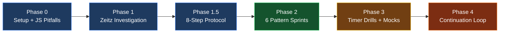

# The Frontend Developer's Algorithmic Puzzle Plan — v2

> Original synthesis: Backhouse, Kaufman, Zeitz, Khamies, Knuth.
> v2: updated with cross-verified research (10-dimension swarm, ~120 sources, Jul 2026).
> Companion document: `algorithm-interview-resources.md` (full evidence + citations).

You have a unique advantage: 7 years of professional experience. You already know how to build things, debug, and write clean code. LeetCode is **not** a test of your intelligence; it is a test of whether you know the "folklore" (patterns) of a very specific, slightly artificial game.

## What Changed in v2 (Read This First)

Research validated the plan's core architecture — pattern-first learning, a repeatable protocol, time-boxed drills, narration, skipping Hards. Four structural updates:

1. **20 hours buys pattern literacy, not readiness.** Consensus time-to-ready for experienced devs is 40–100h. This plan is now explicitly **Phase 1** — with a Phase 2 continuation loop defined at the end.
2. **Two practices added** — the two most-endorsed non-solving habits the original lacked: a **spaced-repetition redo loop** and **external mock interviews**.
3. **Communication re-framed.** interviewing.io's 100K-interview dataset: Code & Solve drive advance decisions ~3–6× more than Communication. Narration is a **gate** (silence = strong no-hire), not a lever. Correct-first, narrated-always.
4. **Khamies demoted, better authorities installed.** The book is real but self-published and low-authority; its "communication is the #1 factor" claim is contradicted by data. The protocol itself is corroborated — kept, but now anchored to *Beyond Cracking the Coding Interview* (2025) and the Tech Interview Handbook.

## The Intellectual Foundation (Verified)

| Author | Role in this plan | Verification |
|--------|-------------------|--------------|
| **Kaufman** _(The First 20 Hours)_ | The **engine**: deconstruct, timer, 20-hour commitment, frustration barrier | ✅ Confirmed — schedule scaffolding only, zero algorithm content |
| **Zeitz** _(The Art and Craft of Problem Solving)_ | The **strategy**: investigate before acting; penultimate step; extreme principle; pigeonhole; symmetry | ✅ Confirmed — every attributed concept verified in the book |
| **Backhouse** _(Algorithmic Problem Solving)_ | The **logic**: invariants — prove your loops, don't guess | ✅ Confirmed — invariants are literally the book's central theme |
| **Khamies** _(How to Solve Algorithm Problems)_ | The **protocol**: 8-step interview script (corroborated; keep it) | ⚠️ Partially — real but self-published; "FGCC" expansion unverifiable; communication-#1 claim refuted by data. **Protocol anchored instead to Beyond CTCI + Tech Interview Handbook** |
| **Knuth** _(TAOCP Vol. 1)_ | The **discipline**: difficulty scale, tracing mandate, five features | ✅ Confirmed verbatim from §1.1 and front matter |

**New authorities added by research:**

- **NeetCode** (Navdeep Singh, ex-Google) — free video walkthroughs; the community-default curriculum.
- **Yangshun Tay** (ex-Meta Staff; Blind 75 / Grind 75 / Tech Interview Handbook) — the most-cited single practitioner voice in interview prep.
- **interviewing.io** — the only large-N dataset (100K+ interviews) on what actually predicts passing.

## The Roadmap at a Glance



## Phase 0: The Setup

_Do this before Hour 1._

### 1. Define Your Target Performance Level

> **Target (unchanged):** "I can identify the core LeetCode patterns. When I see an Easy/Medium problem, I can classify it within 3 minutes, apply the template, and write working JavaScript in 15 minutes — while narrating."

**Research nuance:** NeetCode's readiness rule for Phase 2 is stricter — solve an *unseen Medium in 20–25 minutes*. That's the graduation bar for the continuation loop, not this sprint.

### 2. Eliminate Barriers — and Spend $0

- **Language:** JavaScript or TypeScript. Validated twice over: learning new syntax is friction, and Meta/Amazon frontend loops run *in JavaScript anyway*.
- **The free stack (bookmark these):**
  - `neetcode.io` — roadmap + free video per problem
  - `leetcode.com` — execution engine (free tier is enough)
  - `techinterviewhandbook.org/grind75` — time-boxed problem scheduler
  - `github.com/yangshun/tech-interview-handbook` — cheatsheets + interview format guide
  - `github.com/SeanPrashad/leetcode-patterns` — the "if X → use pattern Y" cheat sheet
- **The only course worth your hours:** ThePrimeagen, *The Last Algorithms Course You'll Need* — free, **TypeScript**, ~9h, interview-focused. Use it as the concept layer during Days 1–6 (watch the matching section before each sprint).
- **Close:** YouTube recommendations, your IDE, and any paid platform trials. Premium tools have narrow windows of value — see Phase 4.

### 3. Learn the Three JavaScript Traps First

These silently cost interviewers' confidence when a senior dev trips on them:

1. **`sort()` compares as strings by default.** `[10, 9, 80].sort()` → `[10, 80, 9]`. Always pass a comparator: `.sort((a, b) => a - b)`. And it mutates in place.
2. **No native heap / priority queue.** Either say _"assume a PriorityQueue class"_ (acceptable in most interviews) or implement a minimal one once and keep it in your template file.
3. **`shift()` / `unshift()` / `splice()` are O(n).** Using them inside a loop quietly turns it quadratic. Use an index pointer instead of `shift()` in BFS.

### 4. Embrace the Frustration Barrier

Kaufman warns the first hours feel awful; Zeitz says the solver "gets lost." Expect to feel stupid — it is the friction of loading new patterns, not a lack of ability.

## Phase 1: The Zeitz Investigation

_Goal: Stop reading prompts like a user; start reading them like a detective. (Hours 1–3)_

Unchanged from v1 — research found nothing better:

- **Orientation:** input? output? constraints? Say them **out loud**. The word "sorted" is the difference between `O(n)` and `O(log n)`.
- **Penultimate step:** _"What would the step right before the end look like?"_
- **Get your hands dirty:** manually trace both given examples on paper before typing. Knuth's corollary: _"An algorithm must be seen to be believed."_

## Phase 1.5: The 8-Step Interview Protocol

_Unchanged — corroborated by multiple independent sources. Run it in order, every time:_

1. **Understand** — read carefully; every word matters.
2. **Formalize** — "Given X, return Y."
3. **Repeat the question to yourself** — hidden info lives between the lines.
4. **Bring three examples** — empty case, medium case, corner case.
5. **Brute force** — correctness first, efficiency never.
6. **Analyze complexity out loud** — time and space.
7. **Optimize** — find the bottleneck line; remove it.
8. **Re-analyze** — confirm the improvement.

> **v2 addition — Step 9 (the 2026 step): Explain and defend.** Because of LLM-era interview changes, expect follow-ups even after accepted code: _"Why does this work?" "What input breaks it?" "Walk me through line 5."_ Practice answering these during every drill. Interviewers now grade verification, not just solutions.

## Phase 2: The Backhouse Logic — Six Pattern Sprints

_Goal: Stop guessing at for-loop conditions. Start using invariants. (Hours 4–14)_

### Which Pattern Do I Use?

```mermaid
graph TD
  Q[Read the problem] --> Q1{Find a pair,<br/>duplicate, or<br/>frequency?}
  Q1 -->|Yes| HM[Hash Map]
  Q1 -->|No| Q0{Sorted array<br/>or "find in O log n"?}
  Q0 -->|Yes| BS[Binary Search]
  Q0 -->|No, sorted<br/>or extremes| Q2{Compare from<br/>both ends?}
  Q2 -->|Yes| TP[Two Pointers]
  Q2 -->|No| Q3{Best contiguous<br/>range/subarray?}
  Q3 -->|Yes| SW[Sliding Window]
  Q3 -->|No, recursive<br/>structure| Q4{Tree / nested<br/>data?}
  Q4 -->|Yes| TR[Tree DFS / BFS]
  Q4 -->|"Find ALL combos<br/>permutations subsets"| BT[Backtracking]

  style HM fill:#14532d,stroke:#22c55e,color:#fff
  style BS fill:#14532d,stroke:#22c55e,color:#fff
  style TP fill:#14532d,stroke:#22c55e,color:#fff
  style SW fill:#14532d,stroke:#22c55e,color:#fff
  style TR fill:#14532d,stroke:#22c55e,color:#fff
  style BT fill:#14532d,stroke:#22c55e,color:#fff
```

**Sprints 1–5 unchanged** (Hash Maps · Two Pointers · Sliding Window · Trees · Backtracking) — same Zeitz concepts, same Backhouse invariants, same universal backtracking template from v1.

### Sprint 6: Binary Search — NEW (highest frequency-per-hour you were missing)

- **Why added:** the validated 16-pattern taxonomy puts binary search (incl. "modified binary search") at interview-frequency parity with your five patterns; cost is only 2–3 problems.
- **Zeitz Concept:** Monovariant in disguise — the search space only shrinks.
- **Problems:** Binary Search, Search in Rotated Sorted Array, (stretch) Koko Eating Bananas.
- **The Backhouse Invariant:** _"The answer, if it exists, is always inside `[lo, hi]`."_ Every iteration must shrink the interval while preserving that truth — this is what kills off-by-one bugs.
- **Execution:** Decide `while (lo <= hi)` vs `while (lo < hi)` **from the invariant**, not from memory. Binary search is also a *template* beyond sorted arrays: "search on the answer space" (min capacity, min speed).

## Phase 3: Execution — Timer Drills + The Two Practices v1 Missed

_Goal: Speed, spoken delivery, and retention. (Hours 15–20)_

### The 20-Minute Timer Drill (kept, one rule amended)

1. Pick a problem from **Grind 75** (set: 2h/day, Easy+Medium, your six topics) or the first six categories of the **NeetCode 150 roadmap**.
2. Physical timer: **20 minutes.**
3. Zeitz (3 min orientation) → Backhouse (define invariant) → code → **Step 9: explain and defend your solution out loud**.
4. Timer rings, not done? **STOP.** Watch the NeetCode video or read the solution. Understand it. Close it.
5. **AMENDED v1 rule:** do **not** just move on. Add the problem to your **Redo List** (below). Reading solutions you never re-implement teaches half; re-implementing from memory teaches everything.

### NEW — The Redo Loop (Spaced Repetition)

The most unanimously endorsed retention practice in the research:

- Keep a running **Redo List** of every problem you failed, timed out on, or solved shakily.
- **Re-solve from memory after 2–5 days, then again after 1–2 weeks.** No peeking. If you fail the redo, it stays on the list.
- A green "Success" bar from memory is worth three from fresh exposure.
- This replaces v1's pure "Quantity over Quality" rule: quantity builds exposure, **redo builds retrieval** — and retrieval is what interviews test.

### NEW — External Spoken Practice

Self-narration to your screen is necessary but doesn't simulate a human pushing back. Minimum effective dose:

- **Days 8 and 10:** one external mock each. Free options: **Exponent Practice** (5 free peer credits/month) or **interviewing.io's free AI interviewer**. Have the mock partner interrupt you with "why?" and "what breaks this?" — that is the 2026 interview.
- **Before any real high-stakes loop (Phase 4):** 1–2 paid **interviewing.io** sessions ($179–$339) with vetted FAANG seniors — the calibration gold standard. Their data: top-5% mock performers are 3× more likely to pass real loops.

### Talk Out Loud — Re-framed by Data

| Factor | Weight (per interviewing.io's 100K-interview data) |
|--------|-----------------------------------------------------|
| **Code correctness** | Dominant — drives advance decisions ~3–6× more than communication |
| **Problem solving** (clarify, decompose, handle hints) | Dominant — tied with correctness |
| **Communication** | A **gate**, not a lever: silence/unverbalized thinking ≈ strong no-hire; above the narration threshold, it stops differentiating |
| Testing / edge cases | Explicitly graded (Google & Meta rubrics) |

**Behavioral translation:** always narrate (it's cheap and disqualifying to skip), but never expect narration to compensate for a wrong solution. Correct-first, narrated-always.

## Phase 3.5: Template Compounding (FGCC, kept with a caveat)

The FGCC loop (Focus → Group → Convert → Communicate) remains a good meta-habit — the acronym's exact expansion is unverifiable, but the behavior it describes is independently endorsed:

- **Focus:** name the pattern family while solving.
- **Group:** file each problem with its siblings.
- **Convert:** distill each group to **one code template** (your warm-start baseline).
- **Communicate:** explain the pattern out loud or in writing — teaching exposes the holes.

### Knuth's Difficulty Scale (unchanged — exactly right for this constraint)

| Rating | LeetCode analog | Your action |
|--------|-----------------|-------------|
| `00` | Trivial | Skip |
| `10` | Easy, pattern known | Drill for fluency |
| `20` | Medium, pattern known | **The core of your hours** |
| `30` | Hard Medium | Time-box, then study solution + redo list |
| `40`–`50` | Hard / research | **Never touch in this sprint** |

### Pre-Code Checklist — Knuth's Five Features (unchanged)

Finite · Definite · Input · Output · Effective. If any fails, your design isn't finished — keep thinking.

## Phase 4: The Continuation Loop — NEW

_The honest upgrade: 20 hours is Phase 1. Here's what Phase 2 looks like if interviews are real._

```mermaid
gantt
  title Phase 1 → Phase 2
  dateFormat X
  axisFormat %s
  section Phase 1 (this plan)
  Days 1–6 — 6 pattern sprints     :done, a1, 0, 6
  Days 7–10 — drills + 2 mocks     :active, a2, 6, 10
  section Phase 2 (weeks 3–8)
  NeetCode 150 remainder           :b1, 10, 30
  Weekly external mock             :crit, b2, 10, 30
  Frontend micro-track             :b3, 10, 30
```



- **Weeks 3–8 (~40–60h):** finish the NeetCode 150 roadmap (adds intervals, stacks, linked lists, heaps, graphs, greedy, 1D DP). One external mock per week. Keep the Redo Loop running the whole time.
- **Graduation bar:** unseen Medium in 20–25 minutes, narrated, with complexity stated and follow-ups handled.
- **Final 1–3 weeks before a specific company's loop:** buy **LeetCode Premium** ($35/mo) for company-tagged questions sorted by frequency; read recent Glassdoor/Blind reports for that exact team. Cancel after.
- **Ask your recruiter two questions:** which assessment platform (HackerRank/CodeSignal/CoderPad — practice on that exact engine, since 60–80% of rejections happen at the OA stage), and what the AI-tooling policy is (Amazon disqualifies; Anthropic bans; Meta is piloting an AI-*enabled* round).

## The Frontend Micro-Track — NEW (30 min, 2×/week, runs parallel to everything)

Your seniority is the asset; DSA is the gate. Frontend loops in 2026 include machine-coding rounds this plan's sprints don't touch:

- **JS utilities** (GreatFrontend, free tier): debounce, throttle, `Promise.all`, deep clone, `Array.prototype` polyfills.
- **One machine-coding component per week:** autocomplete, modal, tabs, or data table — built live, narrated, with empty/loading/error states and basic a11y (you already know this part cold — it's your edge).
- This is the same method as the main plan: pattern → template → redo. You already have the muscle.

## Daily Checklist — The 10-Day Schedule

| Day | Hours | Focus | Problems |
|-----|-------|-------|----------|
| 1 | 2h | Hash Maps (+ ThePrimeagen: arrays/hashing) | Two Sum, Valid Anagram, Contains Duplicate |
| 2 | 2h | Two Pointers | Valid Palindrome, Two Sum II, Container With Most Water |
| 3 | 2h | Sliding Window / Monovariants | Best Time to Buy & Sell Stock, Longest Substring Without Repeating Chars |
| 4 | 2h | **Binary Search (NEW)** | Binary Search, Search in Rotated Sorted Array |
| 5 | 2h | Tree DFS | Max Depth, Invert Binary Tree, Same Tree |
| 6 | 2h | Tree BFS + Backtracking | Level Order Traversal, Permutations, Combinations |
| 7 | 2h | Timer drills + **first redo session** (Days 1–3 failures) | Grind 75 / NeetCode picks |
| 8 | 2h | Timer drills + **external mock #1** | + 30 min frontend micro-track |
| 9 | 2h | Timer drills + redo (Days 4–6 failures) | + 30 min frontend micro-track |
| 10 | 2h | Timer drills + **external mock #2** | Full-protocol narrated run |

**Daily ritual (every day):** watch the matching ThePrimeagen section → run the 8-step protocol (+ Step 9) on every problem → narrate out loud → log failures to the Redo List.

## Final Words of Encouragement (Updated)

- **From Zeitz:** _"The explorer is the person who is lost."_ Getting lost means you're doing math.
- **From Backhouse:** Don't hold the whole array in your head. What is the state? What is the invariant?
- **From Kaufman:** _"The early parts of skill acquisition usually feel harder than they really are."_
- **From the data (interviewing.io, 100K interviews):** only ~20% of candidates perform consistently, and even strong candidates fail single interviews ~22% of the time. A rejection is a sample, not a verdict. Volume of *mocks* predicted success better than technical score.
- **From Knuth:** _"An algorithm must be seen to be believed."_ Trace it by hand. Then — and only then — trust it.
- **From 2026:** they will ask you to explain yourself. That's not a threat to you — it's your home turf. You've been explaining code to humans for 7 years.

---

_Set your timer. Get lost. Redo what beat you. Have fun._

_v2 sources: full evidence, citations, and resource pricing in `algorithm-interview-resources.md`; raw research in `research/` (10 dimension reports, cross-verification, insights)._
