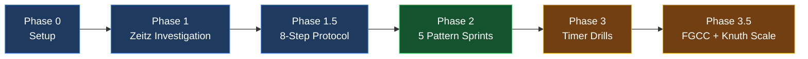
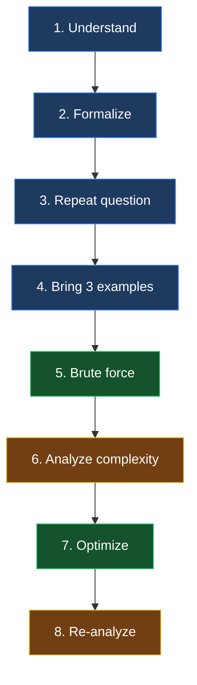
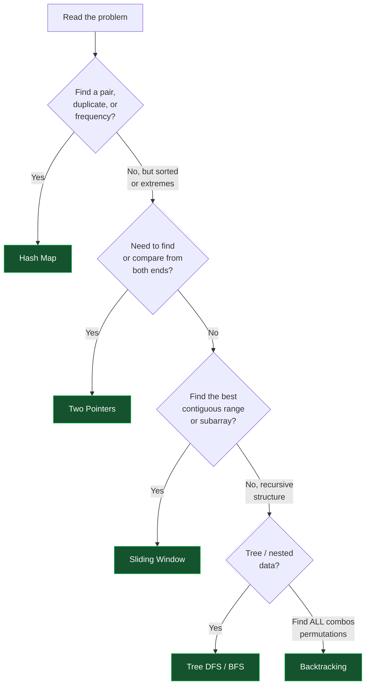

# The Frontend Developer's 20-Hour Algorithmic Puzzle Plan

> Synthesizing Backhouse, Kaufman, Zeitz, Khamies, and Knuth for LeetCode success.

You have a unique advantage: 7 years of professional experience. You already know how to build things, debug, and write clean code. LeetCode is **not** a test of your intelligence; it is a test of whether you know the "folklore" (patterns) of a very specific, slightly artificial game.

## The Five Authors

This plan synthesizes five texts into a single, cohesive execution strategy:

- **Kaufman** _(The First 20 Hours)_ provides the **engine**: deconstruct the skill, define the target, use a timer, prioritize quantity over perfection, and commit to exactly 20 hours.
- **Zeitz** _(The Art and Craft of Problem Solving)_ provides the **strategy**: how to investigate a mystery. Treat LeetCode problems as "Problems" (requiring investigation), not "Exercises" (requiring rote calculation). Get oriented, find the penultimate step, and use tactical lenses.
- **Backhouse** provides the **logic**: how to guarantee your code works without guessing. Use "Invariants" (what stays the same when variables change) to construct loops and pointers with mathematical certainty.
- **Khamies** _(How to Solve Algorithm Problems)_ provides the **protocol**: a repeatable 8-step interview script and the FGCC study framework for converting solved problems into reusable templates. He names what interviewers actually grade.
- **Knuth** _(The Art of Computer Programming, Vol. 1)_ provides the **discipline**: his exercise-rating system calibrates which problems are worth your 20 hours, his "see it to believe it" tracing mandate, and his five-feature definition of an algorithm as a pre-code checklist.

## The Roadmap at a Glance



## Phase 0: The Kaufman Setup

_Do this before Hour 1._

### 1. Define Your Target Performance Level

You are not trying to become a computer scientist. You are trying to **pass an interview**.

> **Target:** "I can identify the 4 core LeetCode patterns. When I see an Easy/Medium problem, I can classify it within 3 minutes, apply the template, and write working JavaScript in 15 minutes."

### 2. Eliminate Barriers

- **Language:** Use JavaScript or TypeScript. Do **not** use Python — learning new syntax is friction.
- **Environment:** Bookmark `leetcode.com`. Close YouTube. Close your IDE. You only need the browser.

### 3. Embrace the Frustration Barrier

Kaufman warns that the first hours will feel awful. Zeitz says the problem solver "gets lost." Expect to feel stupid — this is not a lack of ability; it is the friction of loading new patterns into your brain.

> **Key Idea:** Khamies adds a sharper diagnosis: you can grind for months, skip weekends, and still fail — not from lack of effort, but from **lack of effectiveness**. The fix is not more hours; it is a systematic approach plus focus on problems that matter for the role.

## Phase 1: The Zeitz Investigation

_Goal: Stop reading prompts like a user; start reading them like a detective. (Hours 1–3)_

Zeitz argues that beginners fail because they don't investigate before acting. Before you write any code, execute these strategies.

### Strategy 1: Orientation — "What is this?"

When you read a LeetCode problem, answer these questions **out loud** (literally, speak to your screen):

- **What is the input?** Array of integers? String? Binary tree?
- **What is the output?** A single number? A boolean? A modified array?
- **What are the constraints?** Is the array sorted? Are there negative numbers? What is the length?

> **Tip:** This is exactly like reading a Jira ticket. Don't write CSS until you know if it's mobile or desktop.

### Strategy 2: The Penultimate Step

Zeitz asks: _"What would the step right before the end look like?"_

- **Problem:** "Find the max profit from buying and selling a stock."
- **Penultimate thought:** "To know the max profit, I need to know the lowest price before the highest price."
- **Action:** This instantly tells you that you need to track a `minPrice` variable as you iterate.

### Strategy 3: Get Your Hands Dirty

Zeitz demands you experiment. LeetCode gives you examples — **do not skip them**. Manually trace Example 1 and Example 2 on scratch paper. Write down the array. Draw arrows. Cross out numbers.

> **Key Idea:** Knuth's corollary is absolute: _"An algorithm must be seen to be believed, and the best way to learn what an algorithm is all about is to try it."_ Before you type a single line, dry-run the examples on paper and predict the output. If you can't predict it by hand, you don't understand it well enough to code it.

## Phase 1.5: The 8-Step Interview Protocol

_Goal: Turn the investigation into a repeatable script. This is what separates a candidate who "tries to solve" from one who systematically solves._

Run this protocol **in order, every time**:



1. **Understand the problem** — Read carefully. Pay attention to every word. _"Reading the question is half of the answer."_
2. **Formalize the problem** — Restate it as a single input → output question: _"Given X, return Y."_
3. **Repeat the question to yourself** — Hidden information lives between the lines. The word "sorted" in a binary-search prompt is the difference between `O(n)` and `O(log n)`.
4. **Bring three examples** — not one. Each serves a purpose:
   - An **empty-case** input (empty array, empty string, null) — tests edge handling.
   - A **medium-case** input — exercises the general flow.
   - A **corner-case** input (duplicates when unique is expected, negatives when positives are assumed) — exposes assumptions.
5. **Develop a brute-force solution** — Quick and dirty. Correctness first, efficiency never. Just get something that works.
6. **Analyze its complexity** — State the time and space complexity **out loud**. This tells the interviewer you can reason about cost, and it sets up the next step.
7. **Optimize** — Go line-by-line through the brute force and find the bottleneck (the operation whose time complexity dominates). Remove it. This step is the literal difference between a beginner and an experienced candidate.
8. **Re-analyze the optimized complexity** — Confirm the improvement. If you reach this step, you have passed the technical bar.

> **Tip:** This is your code-review and debugging reflex applied to yourself in real time. Step 7 is exactly how you profile a slow React render — find the expensive operation, eliminate it.

## Phase 2: The Backhouse Logic

_Goal: Stop guessing at for-loop conditions. Start using Invariants. (Hours 4–15)_

Backhouse teaches that an algorithm is just a series of state changes. An **Invariant** is a condition that remains true from the start of your loop to the end. If you define the invariant first, the code writes itself.

### Which Pattern Do I Use?



### Sprint 1: Hash Maps — The Pigeonhole Tactic

- **Zeitz Concept:** The Pigeonhole Principle. _"If I need to find a pair, a duplicate, or a frequency, I need a Hash Map."_
- **Problems:** Two Sum, Valid Anagram, Group Anagrams.
- **The Backhouse Invariant:** _"The Hash Map always contains the exact frequency/state of all elements we have looked at so far."_
- **Execution:** You don't guess. Declare the map → iterate → update the map → check the map → done.

### Sprint 2: Two Pointers — The Extreme Principle

- **Zeitz Concept:** The Extreme Principle — look at the biggest, smallest, leftmost, or rightmost things first.
- **Problems:** Valid Palindrome, Container With Most Water.
- **The Backhouse Invariant:** _"The area between the pointers is currently the maximum possible area for all pairs we have eliminated."_
- **Execution:** Why move the shorter pointer in Container With Most Water? Because moving the taller one can only decrease the area. This is pure Backhouse logic — we **prove** which pointer to move, we don't guess.

### Sprint 3: Sliding Window — Monovariants

- **Backhouse Concept:** A **Monovariant** is something that only moves in one direction.
- **Problems:** Best Time to Buy and Sell Stock, Maximum Subarray.
- **The Backhouse Invariant:** _"The current window is the largest valid window ending at index `right`."_
- **Execution:** The `right` pointer only moves forward (monovariant). The `left` pointer only moves forward to shrink the window when the invariant is broken.

### Sprint 4: Trees — Symmetry

- **Zeitz Concept:** Look for symmetry. A tree is perfectly symmetrical recursion.
- **Problems:** Max Depth of Binary Tree, Invert Binary Tree.
- **The Frontend Connection:** A tree is just a nested JSON object, or the DOM. `node.left` is `element.firstChild`.
- **The Backhouse Invariant:** _"My recursive function correctly calculates the depth of the subtree rooted at the current node."_
- **Execution:** Base case first (`if (!node) return 0`). Then trust the recursion (`1 + Math.max(left, right)`).

> **Key Idea:** Knuth's depth — traversal is the foundation here. Inorder, preorder, and postorder are just three orderings of the same "visit" operation. Every tree DFS problem is a traversal with a custom `visit`.

### Sprint 5: Backtracking — The "Find All..." Pattern

- **Khamies Concept (FGCC):** When a problem says _"Find all the combinations / permutations / subsets / paths,"_ it is a backtracking problem. It is DFS applied to non-graph data, with a constraint that prunes the search.
- **Problems:** Permutations, Combinations, Letter Combinations of a Phone Number.

**The Backhouse Invariant** — three components define every backtracking solution:

1. **Goal** (base condition): when to stop and record a result.
2. **Constraints:** what paths to reject.
3. **Options:** what to choose at each step.

**The universal template** (Khamies) — commit it to memory:

```js
function dfs(collection, path, result) {
  if (/* stop condition */) {
    result.push([...path]); // copy the path — mutation must not leak
    return;
  }
  for (const item of collection) {
    // choose → explore → (path is copied, so "unchoose" is automatic)
    dfs(/* remaining options */, [...path, item], result);
  }
}
```

- **Execution:** Recognize the "find all..." phrasing (**F**ocus), group these problems together (**G**roup), and reuse this one template for all of them (**C**onvert).

## Phase 3: The Kaufman Execution

_Goal: Build speed and overcome the fear of failure. (Hours 16–20)_

### The "Quantity over Quality" Rule

Zeitz and Kaufman both agree: do **not** try to write elegant, perfectly refactored code.

- Use `let` freely.
- Use `break` statements.
- Write ugly, imperative `for` loops.
- Your only goal is to make the green **"Success"** bar appear.

### The 20-Minute Timer Drill

For the final 5 hours, do timed mock interviews:

1. Pick a random Easy/Medium from the "Top Interview 150" list.
2. Set a physical timer for **20 minutes**.
3. Apply Zeitz (3 mins orientation) → Backhouse (define invariant) → code.
4. **CRITICAL Kaufman Rule:** If the timer goes off and you aren't done, **STOP**. Look at the solution. Read it. Understand it. Close it. Start a new problem.

> **Key Idea:** Knuth sharpens this rule: _"Do not turn to the answer until you have made a genuine effort to solve the problem by yourself."_ When the timer ends and you read the solution, you have **earned** it. You attempted, you hit the wall, and now the pattern will stick. Reading solutions you never attempted teaches nothing; reading solutions after genuine struggle teaches everything.

### Talk Out Loud — Khamies's #1 Factor

Of the eight factors interviewers actually grade, Khamies ranks **communication** as "by far the most important":

| # | Factor | Why it matters |
|---|--------|----------------|
| 1 | Communication | A flawed solution narrated well often passes |
| 2 | Algorithm/data-structure knowledge | Can you optimize past brute force? |
| 3 | Problem-solving skills | Do you clarify before coding? |
| 4 | Attention to detail | Did you catch the word "sorted"? |
| 5 | Code efficiency | Right data structure for the job |
| 6 | Complexity analysis | State the Big-O, out loud |
| 7 | Modular code | Break it into functions |
| 8 | Debugging | Fix your own bugs before they ask |

A perfect silent solution can still fail; a flawed solution, narrated well, often passes. During every timed drill: **narrate**. Restate the problem. State your brute force. State its complexity. State your optimization and why.

## Phase 3.5: The FGCC Study Loop + Knuth's Difficulty Scale

_Goal: Make every solved problem compound. Solving 50 problems is useless if they don't generalize into reusable templates._

### The FGCC Loop (Khamies)

Run this continuously across the plan:

- **F — Focus:** While solving, actively notice the pattern. Ask _"what family does this belong to?"_
- **G — Group:** File the problem with its siblings (Two Sum ↔ Valid Anagram; Permutations ↔ Combinations).
- **C — Convert:** Distill each group down to **one code template**. The template is your warm-start baseline; a new problem is just fine-tuning it.
- **C — Communicate:** Explain the pattern out loud, in writing, or to another person. Teaching is the fastest way to find the holes in your own understanding.

> **Tip:** Khamies's analogy — you don't train GPT from scratch; you fine-tune a baseline. Your templates are the baseline; each new problem is a fine-tune.

### Knuth's Difficulty Scale

Knuth rates every exercise **00–50**. Borrow this scale for LeetCode problem selection:

| Rating | Meaning | LeetCode analog | Your action |
|--------|---------|-----------------|-------------|
| `00` | Immediate | Trivial | Skip — not worth your time |
| `10` | ~1 minute | Easy, pattern known | **Drill these for fluency** |
| `20` | ~15 minutes | Medium, pattern known | **The core of your 20 hours** |
| `30` | 2+ hours | Hard Medium | Stretch goal — time-box, then study solution |
| `40` | Term project | Hard | Avoid during this sprint |
| `50` | Research problem | Unsolved | **Never touch** |

> **Warning:** Knuth himself marks the hardest material with an asterisk and says to skip it on first reading. Life is too short, and interviews don't ask research problems.

### Pre-Code Checklist — Knuth's Five Features

Before you type, run this 5-second gut check:

- **Finite** — does it terminate?
- **Definite** — is every step unambiguous?
- **Input** — does it take the right inputs?
- **Output** — does it produce the right outputs?
- **Effective** — is every operation doable by hand?

If yes on all five, code with confidence. If not, your design isn't finished — **keep thinking**.

## Daily Checklist — A 10-Day Schedule

_Aim for ~2 hours a day. Total = 20 hours._

```mermaid
gantt
  title The 20-Hour Roadmap
  dateFormat X
  axisFormat %s
  section Patterns
  Day 1 — Hash Maps          :done, d1, 0, 1
  Day 2 — Two Pointers       :d2, 1, 2
  Day 3 — Monovariants       :d3, 2, 3
  Day 4 — Sliding Window     :d4, 3, 4
  Day 5 — Tree DFS           :d5, 4, 5
  Day 6 — Tree BFS + Backtrack :d6, 5, 6
  section Execution
  Day 7 — Timer Drill        :active, d7, 6, 7
  Day 8 — Timer Drill        :d8, 7, 8
  Day 9 — Timer Drill        :d9, 8, 9
  Day 10 — Timer Drill       :crit, d10, 9, 10
```



| Day | Hours | Focus | Problems |
|-----|-------|-------|----------|
| 1 | 2h | Hash Maps | Two Sum, Valid Anagram, Contains Duplicate |
| 2 | 2h | Two Pointers | Valid Palindrome, Two Sum II, Container With Most Water |
| 3 | 2h | Monovariants | Best Time to Buy and Sell Stock, Maximum Subarray |
| 4 | 2h | Sliding Window | Longest Substring Without Repeating Characters |
| 5 | 2h | Tree DFS | Max Depth, Invert Binary Tree, Same Tree |
| 6 | 2h | Tree BFS + Backtracking | Level Order Traversal, Permutations, Combinations |
| 7–10 | 8h | **Timer Drill** | As many Easy/Mediums as possible, narrated out loud |

- **Day 1:** Run the full 8-step protocol on Two Sum — it becomes your reference for how every future problem should feel.
- **Day 5:** Practice Knuth's "visit" framing — define the visit, pick the order.
- **Day 6:** Begin your FGCC template file today.
- **Days 7–10:** Narrate out loud the whole time (Khamies's communication factor).

## Final Words of Encouragement

- **From Zeitz:** _"The explorer is the person who is lost."_ Getting lost on a LeetCode problem doesn't mean you're a bad developer. It means you're doing math.
- **From Backhouse:** _"Mastery of complexity is especially important."_ Don't hold the whole array in your head. Abstract it — what is the state? What is the invariant?
- **From Kaufman:** _"The early parts of the skill acquisition process usually feel harder than they really are."_ Push through the first 5 hours. It will click.
- **From Khamies:** Effectiveness beats raw effort. A systematic 20 hours with the protocol and templates will outperform 100 hours of unstructured grinding.
- **From Knuth:** _"An algorithm must be seen to be believed."_ Trace it by hand. Then — and only then — trust it.

---

You have built complex frontend architectures. You can absolutely learn to invert a binary tree. Set your timer. Get lost. Have fun.
